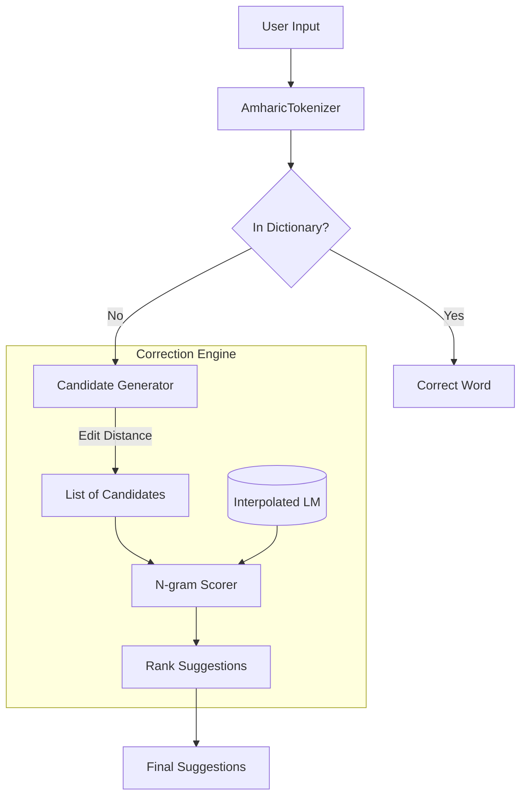

# Amharic Spell Checker (Interpolated N-gram Model)

A robust, context-aware spell checker for the Amharic language. This project uses a **Linear Interpolated N-gram Model** (Trigram + Bigram + Unigram) to suggest corrections that fit the context of the sentence.

## 🚀 Key Features

*   **Interpolated Smoothing**: Combines Trigram, Bigram, and Unigram probabilities to handle unseen contexts gracefully.
*   **Efficient Edit Distance**: Uses optimized Damerau-Levenshtein distance to find candidate words.
*   **Amharic Preprocessing**: specialized normalization and tokenization for the Ethiopic script.
*   **Modern Interface**: Includes a **Streamlit Web App** and a **Typer CLI**.
*   **Type-Safe**: Fully type-hinted codebase.

## 📦 Installation

This project is managed with `pyproject.toml`.

```bash
# Clone the repository
git clone https://github.com/yourusername/amharic-spell-checker.git
cd amharic-spell-checker

# Install dependencies
pip install -e .[dev]
```

## 🛠️ Usage

### 1. Training the Model

Before using the spell checker, you must train the N-gram model on a corpus.

```bash
python scripts/train.py data/amharic_corpus.txt --output-path models/ngram_model.pkl
```

### 2. Web Interface (Streamlit)

Launch the interactive web demo:

```bash
streamlit run src/amharic_spell/app/web.py
```

### 3. Command Line Interface (CLI)

Check a single sentence:

```bash
python src/amharic_spell/app/cli.py "የቤት ውስጥ ስራ የሴቶች ስራ ብቻ ሳይቻሆን"
```

## 🏗️ Architecture



## 🧪 Testing

Run duplicate tests to ensure reliability:

```bash
pytest
```

## 📄 License

MIT License